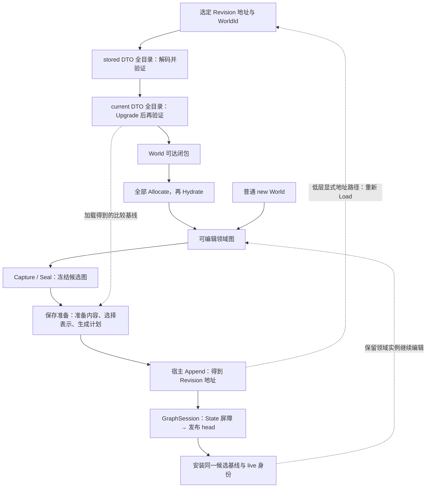

# DurableGraph 项目术语表

> 以产品代码 `5e7c5d6`（DB-034）为初始校准点，2026-09-07。
> 本文维护首选用语、概念关系及代码落点，供后续文档、代码命名和注释的一致化使用。
> 当前能力查 [PROJECT-STATE](../src/PROJECT-STATE.md)，长期约束查[目标设计](DurableGraph-target-design-v0.md)，未完成工作查[路线图](DurableGraph-research-roadmap.md)。

## 使用与维护

- 表中粗体为讨论和说明文字的首选术语；代码符号标明**当前落点**，不意味着所有符号已经采用首选命名。
  同一行并列的词由释义说明其关系，只有明确标为同义才可互换。
- 已实现词条以当前源码为依据；遇到词义与实现不一致，应记录差异并修订，不能据词条推定代码已有某种行为。
  标为“目标”的词只链接设计，不虚构代码落点。本文不维护实现进度或测试计数。
- 解释 `Current`、`Base/Delta`、`head`、`body/payload` 等词时保留所属对象或阶段；代码引用保留符号原拼写。
  本文内的链接锚点按概念命名，后续改名尽量保留原锚点供旧链接检索。
- 概念演变时同步更新首选词、边界和旧称映射。确有等价改名证据才写“旧称 → 新称”；
  拆分、合并或职责改变需说明对应关系。历史文档保留当时用语及上下文，迁移范围由独立变更确定。
- 生成符号标注“SG 生成”，链接生成器发出位置或代表性测试；不依赖临时 `obj` 路径。
  每项取最能解释含义的代码入口，避免扩展为所有方法的 API 索引。

## 一张流程图定位阶段



新建图的 `PrepareNew` 使用无 Parent 计划；已加载图的 `Prepare` 使用固定 Parent。
图中展开了 LoadedWorld 保存准备的内部流程；内容层 `CaptureSession.Prepare` 只消费已经 Seal 的候选。
GraphSession.Commit 受控完成整条发布与安装路径；低层 Append 自身仍不发布。各阶段推进什么状态见下列词条。

## Schema、类型与生成代码

统一目录的设计与实现证据见 [DB-046](design-branches/0046-unified-schema-catalog-slice.md)。

| 项目内术语／代码符号 | 释义与示意 | 关键代码 |
|---|---|---|
| <a id="schema-family"></a>**定义身份与闭合 Schema 族（definition identity / closed Schema family）** | DefinitionId 标识声明，例如 `Box<T>` 的 `Box`；闭合族还包括有序类型实参，`Box<int>` 与 `Box<Point>` 是不同族。`DurableSchema.SchemaId` 保留定义 ID 便捷入口，不能独自区分泛型闭合族；两者都不指定版本。 | [TypeExpr](../src/DurableGraph/TypeExpr.cs)、[DurableSchema](../src/DurableGraph/DurableSchema.cs) |
| <a id="type-expression"></a>**类型表达与定义模式（TypeExpr / type pattern）** | `Builtin(tag)`、`Named(DefinitionId, args)`、SZ/rank 2–4 数组及 `List(element)`、`Nullable(child)`、`Dictionary(key,value)` 构造递归表达支持范围内的名义类型；定义模板还可含声明内的 `Parameter(ordinal)`，如 `List<T[]>`。List/Nullable 是内建一元构造，Dictionary 是内建双实参构造，不使用 Named 冒充用户定义。闭合 Schema/key 不允许 Parameter；类型形参名字、CLR Type/helper 类型不是持久身份。 | [TypeExpr](../src/DurableGraph/TypeExpr.cs)、[类型表达 wire](../src/DurableGraph.StateStore/TypeExprWireCodec.cs) |
| <a id="schema-key"></a>**Schema 键（SchemaKey）** | `(闭合 TypeExpr, DefinitionVersion)`，由完整用户 Schema 派生的查询、冲突索引；非泛型是 `Named(id, [])`。统一目录不单独编码 SchemaKey，exact 依赖使用记录 ID。相同键仍须核对完整定义，不承诺两个独立空仓库的同键布局相同；key 不能代替完整布局或用于跨库互换。 | [SchemaKey](../src/DurableGraph.StateStore/SchemaKey.cs)、[SchemaStore](../src/DurableGraph.StateStore/SchemaStore.cs) |
| <a id="representation-id"></a>**持久表示 ID（RepresentationId）** | 仓库内对象表示的持久整数入口，使用统一目录编号空间；0 无效，1 固定 string，动态节点从 2 单调登记，不回收、不跨仓库解释。class 的 Schema 记录直接作为其表示；inline 节点虽占用编号，但不是对象表示，GetRepresentation/Base 必须拒绝。相同完整表示复用，不同名义身份不能因 DTO CLR 类型相同而合并；数组 shape、容器 Count、Dictionary comparer 不参与。ID 不标识对象实例或 Revision，也不锁定引用目标版本。 | [RepresentationId](../src/DurableGraph.StateStore/RepresentationId.cs)、[SchemaStore](../src/DurableGraph.StateStore/SchemaStore.cs)、[统一目录记录](../src/DurableGraph.StateStore/SchemaCatalogEntry.cs) |
| <a id="schema-catalog-entry"></a>**闭合目录记录（SchemaCatalogEntry）** | 一条有持久编号的 reference Schema、inline Schema、数组、List 或 Dictionary 描述；string 为隐式内建项。List/Dictionary 分别使用目录 kind 4/5，不产生用户 Schema。base/inline 边指向已登记 exact 记录，普通引用槽保存无版本 nominal 约束。用户 Schema 记录包含完整名义身份、定义版本和本层字段；读取时重建 DurableSchema/ObjectLayout 视图，不另存 class 表示到 Schema 的转接记录。 | [SchemaCatalogEntry](../src/DurableGraph.StateStore/SchemaCatalogEntry.cs)、[SchemaCatalogWireCodec](../src/DurableGraph.StateStore/SchemaCatalogWireCodec.cs) |
| <a id="exact-schema"></a>**完整精确 Schema（exact Schema）**／`DurableSchema` | 一版不可变闭合定义：完整名义类型、定义版本、SchemaKind、本层字段及完整 base/inline 精确依赖闭包。`DurableSchema.Equals` 检查这些内容；“同 exact Schema”比“同 Schema 键”更强。本文不加限定的 Schema 指完整定义。 | [DurableSchema.Equals](../src/DurableGraph/DurableSchema.cs) |
| <a id="definition-template"></a>**定义模板（definition template）**／`StateSchemaTemplate` | 一版开放声明的 kind、arity、字段模式及固定 base/inline 版本。它与完整 stored Schema 结构匹配后才能得到该次历史执行布局；模板本身不替代闭合 exact Schema。DTO 参数与 CLR 工厂信息属于派生执行材料，不额外形成持久身份。 | [StateSchemaTemplate](../src/DurableGraph/StateDefinitionBinding.cs)、[StateBindingContext.BindSchema](../src/DurableGraph/StateBindingContext.cs) |
| <a id="base-schema"></a>**精确基 Schema（exact BaseSchema）** | 派生定义绑定某一完整基类定义，例如 `Hero V3 → Character V2`。基类定义改变会改变派生定义，派生版本也须递增；这里的 Base 是继承关系，不是对象内容 Base。 | [DurableSchema.BaseSchema](../src/DurableGraph/DurableSchema.cs)、[祖先历史验证](../tests/DurableGraph.Tests/SchemaAncestryHistoryTests.cs) |
| <a id="schema-kind"></a>**Schema 种类（SchemaKind）** | ReferenceObject 表示具有对象身份的用户引用类型，InlineValue 表示嵌套值布局；同 DefinitionId 跨版本不得切换 kind 或 arity。不同于 ObjectStateKind 的 durable/string/array/list 内容分类，也不同于目录行的编码 kind。 | [SchemaKind](../src/DurableGraph/SchemaKind.cs)、[DurableSchema](../src/DurableGraph/DurableSchema.cs) |
| <a id="inline-value"></a>**内联复合值（inline value）／精确值 Schema** | 用户直接标记 DurableType 的 struct（含 record struct），拥有 Schema/history；字段的 InlineSchema 绑定 exact 布局，变化沿 inline/base 传播。record 属性以 field-target 标注实际 backing storage，不持久化属性方法或合成比较。DTO/body 嵌套而非 CLR 声明嵌套；无独立对象行、Model 或自动 Upgrade。 | [DurableFieldInfo.InlineSchema](../src/DurableGraph/DurableFieldInfo.cs)、[共享值 DTO/body 发出逻辑](../src/DurableGraph.Generator/DurableSchemaGenerator.InlineState.cs)、[record 字段合同](design-branches/0056-record-struct-state-slice.md) |
| <a id="durable-enum"></a>**持久枚举（Durable enum）** | 显式 DurableType 的用户 enum；复用 InlineValue Schema，以独立 nominal/版本及 FieldId=1 的底层整数槽描述。生成 Family DTO/body，外置投影静态转换领域 enum；不持久化常量表/Flags，不拒绝未命名数值。底层布局变化须升版，数值业务重解释由显式 Upgrade 负责。无独立对象行或新格式；不同 enum 不因整数宽度相同合并身份。 | [enum 生成](../src/DurableGraph.Generator/DurableSchemaGenerator.Enums.cs)、[当前模板校验](../src/DurableGraph/StateDefinitionBinding.cs)、[DB-053](design-branches/0053-enum-inline-state-slice.md) |
| <a id="builtin-scalar"></a>**内建标量值（builtin scalar value）** | 无递归子槽的框架内建值，不等于 CLR Primitive 或固定字节宽度。包括原 13 种标量及 Guid/decimal/TimeSpan；DTO 直接保留值，不创建用户 Schema 或对象行。Guid 完整 128 bit、decimal 四字含 scale/符号、TimeSpan 有符号 Ticks；string 仍是引用对象。 | [TypeTag](../src/DurableGraph/TypeTag.cs)、[三值静态操作](../src/DurableGraph/BclScalarStateValues.cs)、[完整 decimal 比较](../src/DurableGraph.StateStore.Serialization/Serialization/ScalarStateEquality.cs) |
| <a id="nullable-value"></a>**可空值槽（Nullable value slot）**／`NullableValueLayout`、`NullableState<TState>` | 领域使用 `T?`，冻结状态保存有值/无值标记及 unmanaged child；完整槽保留 child exact 布局，ValueSchema 暴露内部 inline 依赖。absent 不访问 child 或形成引用边；包装无独立 Schema 版本、ObjectId 或目录行。显式 `AllowNullableLifting` 可提升已绑定 child 升级工具，但空内容不免除能力预检。 | [NullableValueLayout](../src/DurableGraph/NullableValueLayout.cs)、[状态与静态操作](../src/DurableGraph/NullableStateValues.cs)、[DB-052](design-branches/0052-nullable-value-slot-slice.md) |
| <a id="nominal-reference"></a>**名义引用约束（nominal reference constraint）**／`TargetType` | 引用槽约束目标的完整闭合族，不绑定目标版本。实际目标 Schema 自身或其祖先须属于该族；泛型实参不自动协变。目标升版不使引用方升版，改变槽约束则改变引用方 Schema；旧 `TargetSchemaId` 只是定义 ID 便捷入口。 | [DurableFieldInfo](../src/DurableGraph/DurableFieldInfo.cs)、[StateReferenceValidator](../src/DurableGraph/StateReferenceVisitor.cs) |
| <a id="field-id"></a>**持久字段编号（FieldId）与声明段** | FieldId 在声明它的 Schema 内唯一，继承链各段独立编号；基类和派生类都可有字段 1。Schema 字段类型由 TypeTag 描述；ObjectReference tag 15 携带 closed Named/Array/List/Dictionary 约束，string 槽仍用 tag 4。引用 DTO 槽为 ObjectId，wire ID 编码为 UInt32。 | [DurableFieldInfo](../src/DurableGraph/DurableFieldInfo.cs)、[TypeTag](../src/DurableGraph/TypeTag.cs) |
| <a id="state-dto"></a>**版本化状态 DTO（Versioned state DTO）** | 与 exact Schema 配对的 readonly/unmanaged 状态值：标量存值，引用存非泛型 `ObjectId`，inline struct 嵌套 exact DTO，包含祖先字段。泛型 DTO 只带状态表示参数，不带领域/helper 参数；相同 DTO CLR 类型仍不证明槽语义或 exact Schema 相同。 | [Family DTO/body 发出逻辑](../src/DurableGraph.Generator/DurableSchemaGenerator.GenericState.cs)、[原非泛型 DTO 发出逻辑](../src/DurableGraph.Generator/DurableSchemaGenerator.GeneratedState.cs) |
| <a id="state-family-host"></a>**状态族宿主（generated Family host）**／`Generated.Family_<UTF8HexId>.Vn<TState…>` | 泛型、组合值（含 Nullable）、当前 enum、显式 owner/value Upgrade 或有当前声明且保留孤立 inline history 的编译使用的独立生成宿主；历史 DTO/body 不嵌入当前领域类型，可由普通 using 别名命名。其余纯非泛型旧管线保留 `__DurableState.Vn` 及共享 inline helper；这是生成 API 路径差异，不是两套持久身份。 | [Family 发出逻辑](../src/DurableGraph.Generator/DurableSchemaGenerator.GenericFactories.cs)、[真实消费者 Upgrade](../experiments/PackageConsumerProbe/GenericConsumer/Upgrades.cs) |
| <a id="schema-history"></a>**Schema 历史材料（Schema history）**／`.dgschema` | 构建期积累的定义模板记录，含声明 arity、参数模式与固定依赖版本，供 SG 重建历史状态代码；不是某次对象状态，也不枚举全部闭合布局。当前新写 v8：v5/v6/v7 分别引入 List/Nullable/Dictionary 模式，v8 增加 Guid/decimal/TimeSpan 叶子；已有 v1–v7 文件原样保留，各版递归拒绝不属于该版的构造或叶子。manifest 描述本次候选；已接受历史须独立闭包，候选不能修补旧缺口。 | [SchemaHistoryTool](../src/DurableGraph.Build/SchemaHistoryTool.cs)、[模板解析](../src/DurableGraph.Generator/DurableSchemaGenerator.TemplateHistory.cs) |
| <a id="schema-store"></a>**持久 Schema 与表示目录（SchemaStore）** | 在 `schemas.rbf` 追加保存统一闭合目录；同一批次包含全部缺失节点及其 base/inline exact 依赖，一次追加与持久屏障后安装。校验同键完整定义和 kind/arity，nominal 引用不形成 exact 依赖。登记独立于 State 发布；Count 只统计用户 Schema，含 inline。只持久元数据；ResolveReader 按本次冻结代码目录取得历史读取绑定，不全局缓存另一 snapshot 的 reader。 | [SchemaStore](../src/DurableGraph.StateStore/SchemaStore.cs)、[统一目录格式](../src/DurableGraph.StateStore/SchemaCatalogWireCodec.cs) |
| <a id="definition-binding"></a>**定义能力绑定（StateDefinitionBinding）** | 某声明的保留模板、当前/历史工厂及 owner Upgrade providers；`Generated.DurableDefinitions.Register` 显式登记，不枚举全部闭合组合。操作快照按实际 CLR 类型或 stored exact Schema 按需闭合为 value/reader/model binding。 | [StateDefinitionBinding](../src/DurableGraph/StateDefinitionBinding.cs)、[操作快照](../src/DurableGraph.StateStore/StateModelSnapshot.cs) |
| <a id="value-binding"></a>**值槽绑定与静态操作（StateValueBinding / IStateOps / IValueProjection）** | 值槽绑定把完整槽语义与派生的状态/操作 CLR 类型配对；历史 IStateOps 只处理冻结 DTO，当前 IValueProjection 在领域值与状态间转换。SG 已知字段直接调用，未定泛型值经闭合静态 helper 调用；这些 CLR 类型不写入持久身份。 | [静态值合同](../src/DurableGraph/StateValueBinding.cs)、[绑定与结构匹配](../src/DurableGraph/StateBindingContext.cs) |
| <a id="state-equals"></a>**持久状态相等（StateEquals）** | 同一 exact 值槽下的静态比较能力，正常调用不编码、不装箱、无堆分配。按持久字段比较，浮点按 bit pattern、decimal 按 GetBits 完整表示、引用按 ObjectId，忽略 padding/Transient/领域 Equals；与 `!PrepareDelta(a,b).HasChanges` 一致。List 匹配用它试探，真正需要子 patch 的元素对才准备并复用 Delta bytes；不要求普通 owner 额外完整预扫。 | [IStateOps](../src/DurableGraph/StateValueBinding.cs)、[内建比较](../src/DurableGraph/BuiltinStateValues.cs)、[泛型生成](../src/DurableGraph.Generator/DurableSchemaGenerator.GenericState.cs)、[传统 DTO 生成](../src/DurableGraph.Generator/DurableSchemaGenerator.GeneratedState.cs) |
| <a id="dictionary-key-equality"></a>**字典查找相等与持久键相等** | 查找相等由领域 Dictionary 的 comparer 决定；持久相等以同 exact key 槽的完整 canonical Base bytes 对应 frozen 条目。业务可忽略需要保存的 Timestamp；内容相同但 ObjectId 不同的 string 键也可查找等价而持久状态不同，后者应 Remove+Add。CurrentDefault 使用当前 CLR Default，Application 使用 snapshot 的闭合类型选择；历史 DTO 不执行这两种模式的当前业务 lookup，实际 TryAdd 才拒绝当前碰撞。 | [Dictionary body](../src/DurableGraph/DictionaryStateReader.cs)、[key policy](../src/DurableGraph/DictionaryKeyPolicy.cs)、[复合 Key 设计](design-branches/0055-composite-dictionary-key-design.md) |
| <a id="reader-binding"></a>**精确版本读取绑定（ObjectReaderBinding / StateReaderBinding）** | 一份 exact ObjectLayout 与 Base reader、同布局 Delta applier、引用遍历的绑定；独立于当前 CLR 实例及 Upgrade 能力。StateReaderBinding 是用户 class Schema/DTO 的适配器，ArrayStateReader / ListStateReader / DictionaryStateReader 依据 exact 元素或 key/value 槽 绑定历史元素操作，不要求旧领域 struct CLR 类型。 | [对象读取合同](../src/DurableGraph/ObjectBinding.cs)、[StateReaderBinding](../src/DurableGraph/StateReaderBinding.cs)、[ArrayStateReader](../src/DurableGraph/ArrayStateReader.cs)、[ListStateReader](../src/DurableGraph/ListStateReader.cs) |
| <a id="object-binding"></a>**当前对象绑定（ObjectBinding）** | 一个受支持 CLR 引用类型的 current layout、Capture、Normalize、引用遍历、Allocate(record)/Hydrate 能力；统一承接 class、string、array、List、Dictionary。对象边界允许类型擦除，字段/元素热循环仍静态绑定；历史 reader 可独立取得。 | [ObjectBinding](../src/DurableGraph/ObjectBinding.cs)、[ArrayObjectBinding](../src/DurableGraph/ArrayObjectBinding.cs)、[ListObjectBinding](../src/DurableGraph/ListObjectBinding.cs) |
| <a id="model-binding"></a>**当前模型绑定（StateModelBinding）** | ObjectBinding 的用户 durable class 适配器，负责一个闭合族的当前实现及其保留 reader。操作开始冻结模型、定义及 Upgrade provider；SchemaStore 仍是 Repository 内单调积累的实时权威，缓存 UpgradePlan 以 exact Schema requirement set 在 callback 前复核后来登记的定义。 | [StateModelBinding](../src/DurableGraph/StateModelBinding.cs)、[StateModelRegistry](../src/DurableGraph.StateStore/StateModelRegistry.cs)、[Schema requirement set](design-branches/0042-upgrade-schema-requirement-set.md) |

## 对象图、身份与状态视图

| 项目内术语／代码符号 | 释义与示意 | 关键代码 |
|---|---|---|
| <a id="domain-graph"></a>**领域对象图与 World 根（domain graph / World）** | 用户可变领域实例及其持久引用关系，例如 `World → A ↔ B`。World 是入口选定的单根角色，不要求类型名为 World；当前外层加载/准备要求一个非空 exact 类型根。 | [LoadedWorld](../src/DurableGraph.StateStore/LoadedWorld.cs)、[DurableBase](../src/DurableGraph/DurableBase.cs) |
| <a id="object-identity"></a>**CLR 引用身份与对象 ID（reference identity / ObjectId）** | 引用身份区分 CLR 实例；`ObjectId(uint Value)` 是无隐式数值转换的语义包装，在指定 Revision 视图内解释，引用槽中的 0 表示 null，实际对象行 ID 必须非零。Capture 用引用相等关联实例与 ID。值相同的不同非空 string 不合并；空串统一 `string.Empty` 是明确例外。ID 不是 CLR 地址或全仓库永久唯一号。 | [ObjectId](../src/DurableGraph/ObjectId.cs)、[CaptureContext](../src/DurableGraph/CaptureContext.cs)、[CaptureSession](../src/DurableGraph/CaptureSession.cs) |
| <a id="object-state-record"></a>**对象状态记录**／`ObjectStateRecord` | 不可变单对象内存记录：`ID + exact ObjectLayout + frozen 内容`；内容为用户 DTO、string、FrozenArrayState、FrozenListState 或 FrozenDictionaryState。同一代码类型承载捕获、解码与归一化结果；仅有该行不证明它是已接受候选。 | [ObjectStateRecord](../src/DurableGraph/ObjectStateRecord.cs) |
| <a id="object-layout"></a>**精确对象布局（ObjectLayout / ArrayLayout / ListLayout / DictionaryLayout）** | ObjectLayout 是 String / 用户 reference exact DurableSchema / exact ArrayLayout / exact ListLayout / exact DictionaryLayout 的受控判别值，可由合法对象表示 ID 解析得到；inline 目录节点不对应 ObjectLayout。ArrayLayout 保存 codec 版本、数组构造和完整元素槽；ListLayout 保存 codec 版本与完整元素槽，当前仅接受 List codec 2；DictionaryLayout 保存两个 exact 槽与 codec 1。元素 inline Schema 精确绑定，引用元素只保存目标名义约束；数组 shape、容器 Count、Dictionary comparer 和匹配算法不属于类型布局。 | [ObjectLayout / ArrayLayout](../src/DurableGraph/ObjectLayout.cs)、[ListLayout](../src/DurableGraph/ListLayout.cs)、[统一目录格式](../src/DurableGraph.StateStore/SchemaCatalogWireCodec.cs) |
| <a id="frozen-array-state"></a>**冻结数组状态（FrozenArrayState / ArrayShape）** | 一个数组对象的不可变 shape 和 owned row-major 元素状态 buffer；元素为标量、ObjectId 或生成 struct DTO。jagged 外层保存内层 ID，不内联子数组 body。领域数组后续修改不得污染该状态。 | [FrozenArrayState / ArrayShape](../src/DurableGraph/FrozenArrayState.cs)、[数组投影](../src/DurableGraph/ArrayObjectBinding.cs) |
| <a id="list-content-object"></a>**列表内容对象（List content object）** | exact BCL `List<T>` 的独立引用对象，只保存 Count、元素顺序与逻辑内容；Capacity、内部数组和修改计数不持久化。元素使用受支持槽闭包，可递归组合 List、数组和用户泛型；同实例增删保留 ObjectId，同内容的新实例仍是新对象。不包括 List 子类或集合接口字段。 | [ListObjectBinding](../src/DurableGraph/ListObjectBinding.cs)、[列表绑定快照](../src/DurableGraph.StateStore/StateModelSnapshot.Lists.cs) |
| <a id="frozen-list-state"></a>**冻结列表状态（FrozenListState）** | 一个列表对象的 owned 有序元素状态 buffer；Count 为该 buffer 的长度，元素为标量、ObjectId 或生成 struct DTO。后续领域修改不能污染它；嵌套列表保存子列表 ID。没有 ArrayShape，不保存领域 List 的 Capacity。 | [FrozenListState](../src/DurableGraph/FrozenListState.cs)、[ListObjectBinding](../src/DurableGraph/ListObjectBinding.cs) |
| <a id="frozen-dictionary-state"></a>**冻结映射状态（FrozenDictionaryState）** | 实验性 BCL Dictionary 的 owned key/value DTO 条目及 ComparerKind，语义无序。Count 为条目数；两侧引用均为 ObjectId。内部排列、容量、hash/bucket 不构成持久内容；Delta 按 canonical key body 寻址 Remove/Add/PatchValue。完整 source/current DTO 均验证 canonical key 唯一和引用；模式 4/5 的当前业务查找碰撞只在可达图恢复的 TryAdd 拒绝。 | [FrozenDictionaryState](../src/DurableGraph/FrozenDictionaryState.cs)、[DictionaryObjectBinding](../src/DurableGraph/DictionaryObjectBinding.cs)、[DictionaryStateReader](../src/DurableGraph/DictionaryStateReader.cs) |
| <a id="candidate-view"></a>**捕获候选图／候选 DTO 视图（candidate view）**／`CapturedGraph` | 本次 Seal 冻结的根 ID 列表及完整可达对象状态集合；后续领域修改不影响它。durable 行使用捕获模型的当前 DTO。Capture 内核可登记多根，LoadedWorld 产品入口只选一个 World。 | [CapturedGraph](../src/DurableGraph/CapturedGraph.cs)、[CaptureContext](../src/DurableGraph/CaptureContext.cs) |
| <a id="capture-session"></a>**捕获会话与候选协议**／`CaptureSession`、Capture–Seal–Accept–Discard | `BeginCapture → AddRoot → Seal → Accept 或 Discard`。Seal 遍历并复制状态；Accept 安装候选及 live 实例-ID 绑定；Discard 放弃候选，已分配数字仍消耗。`CaptureSession.Current` 是已 Accept 的内存图，接受不等于保存或发布。 | [CaptureSession](../src/DurableGraph/CaptureSession.cs)、[CaptureContext](../src/DurableGraph/CaptureContext.cs) |
| <a id="stored-view"></a>**落盘版本 DTO 视图（stored DTO view）**／`DecodedRevision` | 选定 Revision 的完整 live 冻结状态目录，逐对象保持落盘 exact ObjectLayout，如同目录包含 `A/V1`、`B/V3` 与旧版 Point 元素数组。已解码并验证引用，尚未 Upgrade；无领域实例或可编辑基线。 | [DecodedRevision](../src/DurableGraph.StateStore/DecodedRevision.cs)、[RevisionDecoder](../src/DurableGraph.StateStore/RevisionDecoder.cs) |
| <a id="current-view"></a>**当前版本 DTO 视图（current DTO view）**／`NormalizedRevision` | 全部 source 行按本次操作目录归一化后的冻结状态目录；保留 ID、source ObjectLayout 与 `RequiresRewrite`。current 指模型/表示版本，不是用户刚修改的值，也不是 `CaptureSession.Current`。 | [NormalizedRevision](../src/DurableGraph.StateStore/NormalizedRevision.cs)、[ObjectBinding](../src/DurableGraph/ObjectBinding.cs) |
| <a id="membership-reachability"></a>**源成员集合与根可达闭包（source membership / reachable closure）** | source 是所读 Revision 的全部 live IDs；闭包是 current DTO 图从 World 可达的 IDs。Upgrade 删边后，孤立 A/B 仍须解码、升级、验证，但不再 Allocate；后继候选不含它们时才产生 Remove。使用 live 时说明是哪一个集合。 | [NormalizedRevision](../src/DurableGraph.StateStore/NormalizedRevision.cs)、[LoadedWorld](../src/DurableGraph.StateStore/LoadedWorld.cs) |
| <a id="loaded-baseline"></a>**已加载 World 与固定 Parent 比较基线**／`LoadedWorld<TWorld>` | 可编辑领域 World 配有固定 Parent 地址、完整 source membership、current DTO 比较状态及实例身份关联。Prepare 读取最新领域值，始终相对于此基线；此低层路径由宿主 Append 后重新 Load 建立下一基线；同实例连续保存用 GraphSession。 | [LoadedWorld](../src/DurableGraph.StateStore/LoadedWorld.cs)、[LoadedRevisionPlanner](../src/DurableGraph.StateStore/LoadedRevisionPlanner.cs) |
| <a id="upgrade-normalize"></a>**DTO 升级与归一化（Upgrade / Normalize）** | 用户 class Normalize 按相邻版本执行完整 leaf DTO 转换，不重复升级祖先。数组与 List 各自作为独立内建 owner，以分别选定的 source→current 元素规则转换 owned buffer；不自动搜索相邻值规则路径，空内容也验证能力。均不查询其他对象或分配新 ID；数组保持 shape，List 保持 Count/位置，升级行仍 live 时下次强制 Base。 | [用户 model/Upgrade](../src/DurableGraph.Generator/DurableSchemaGenerator.StateModel.cs)、[数组 owner Upgrade](../src/DurableGraph/StateBindingContext.ArrayUpgrade.cs)、[List owner Upgrade](../src/DurableGraph/StateBindingContext.ListUpgrade.cs)、[NormalizedRevision](../src/DurableGraph.StateStore/NormalizedRevision.cs) |
| <a id="owner-upgrade-provider"></a>**owner 升级提供者（StateUpgradeProvider）** | 明确声明某定义相邻边的通用方法，或某闭合族的专用方法；闭合 provider 优先，选中后失败不回退。框架在该对象首次业务 callback 前绑定完整相邻链及其声明的值依赖；中间 exact 布局必须有依据，不能用 latest 补猜。 | [DurableUpgrade / StateUpgradeProvider](../src/DurableGraph/StateUpgradeProvider.cs)、[Upgrade 绑定](../src/DurableGraph/StateBindingContext.Upgrade.cs) |
| <a id="upgrade-context"></a>**升级上下文（UpgradeContext）** | 一次同步转换的 ObjectId、Source/TargetObjectLayout 与当前 provider 已绑定工具表；array owner 另带 ArrayShape，List/Dictionary owner 分别使用独立 nullable ListCount/DictionaryCount（其他 owner 为 null），Schema 访问器只适用于 durable owner。子值 Context 继承 owner 事实并拥有独立依赖作用域。`GetValueUpgrade<A,B>(key)` 只查本表并核对状态类型，不解析新规则或回查父表。不含图访问/ID 分配，不跨调用保留。 | [UpgradeContext / ValueUpgrade](../src/DurableGraph/UpgradeContext.cs)、[值工具绑定](../src/DurableGraph/StateBindingContext.ValueUpgrade.cs) |
| <a id="value-upgrade-capability"></a>**值升级能力（value upgrade capability）**／`ValueUpgrade<TPrior,TNext>` | 对完整两端槽语义和所选业务规则预绑定的强类型委托，由 owner 显式调用；组合值 provider 可继续调用自己声明的子能力。存在于执行 binding，不进入 DTO，不是 struct Normalize 或自动业务迁移。 | [ValueUpgrade](../src/DurableGraph/UpgradeContext.cs)、[StateValueUpgradeProvider](../src/DurableGraph/StateValueUpgradeProvider.cs)、[值 provider 生成](../src/DurableGraph.Generator/DurableSchemaGenerator.ValueUpgrades.cs) |
| <a id="value-upgrade-rule-set"></a>**值升级规则集（StateValueUpgradeRuleSet）**／`ValueUpgradeRuleSetAttribute` | 应用显式选择的一组值 provider，以本地 CLR marker Type 标识并冻结到操作目录，不成为持久 ID。多个匹配拒绝；仅作者开启 AllowKeepExact、没有显式候选且完整槽相等时可透传。已选候选错误不进入透传。 | [规则集与 provider](../src/DurableGraph/StateValueUpgradeProvider.cs)、[候选绑定](../src/DurableGraph/StateBindingContext.ValueUpgrade.cs) |
| <a id="upgrade-dependency"></a>**升级依赖与局部工具 key（StateUpgradeDependency）** | provider 方法显式声明 `key + 规则集 + source/target 槽位置`；槽由声明定义 ID 与 FieldId 定位，保留继承段。key 区分大小写且只在该 provider 的 Context 中解释；相同状态 CLR 类型或相同 key 不会合并父子作用域。SG 可生成局部字符串常量。 | [UpgradeDependency / StateUpgradeSlot](../src/DurableGraph/StateValueUpgradeProvider.cs)、[常量与声明生成](../src/DurableGraph.Generator/DurableSchemaGenerator.ValueUpgrades.cs) |
| <a id="allocate-hydrate"></a>**领域实例分配与字段填充（Allocate / Hydrate）** | 先为全部可达 class/array/List IDs 分配彼此不同的 exact 实例并登记 string，再填充字段/元素及连接引用。SG class Allocate 使用 RuntimeHelpers.GetUninitializedObject，不执行用户构造器或字段初始化；array 按冻结 shape 分配，List 先构造空列表，全部实例登记后逐元素 Hydrate 并按序 Add。Transient 由用户交付后重建。 | [WorldWorkspace](../src/DurableGraph.StateStore/WorldWorkspace.cs)、[SG Allocate/Hydrate](../src/DurableGraph.Generator/DurableSchemaGenerator.StateModel.cs)、[数组适配器](../src/DurableGraph/ArrayObjectBinding.cs)、[List 适配器](../src/DurableGraph/ListObjectBinding.cs) |
| <a id="reference-operations"></a>**引用槽遍历与引用解析表（VisitReferences / ObjectReadTable）** | 遍历报告 ID 与声明类型约束；class 使用 stored nominal ancestry，数组与 List 要求 exact nominal 类型，string 使用内建约束。校验与可达分析复用遍历；统一 ObjectId→object 表在 Allocate 后提供 Hydrate 解析，只有多个历史 Empty ID 可共享一个实例。字段/元素 body 继续静态绑定。 | [StateReferenceVisitor / Validator](../src/DurableGraph/StateReferenceVisitor.cs)、[ObjectReadTable](../src/DurableGraph/ObjectReadTable.cs) |

## 版本、存活目录与地址

| 项目内术语／代码符号 | 释义与示意 | 关键代码 |
|---|---|---|
| <a id="state-revision"></a>**状态修订（StateRevision）** | 一次修订的冻结描述：Parent、本帧对象记录及 head 目录的表示。Append 后由一个 Revision Frame 承载；尚未追加的 StateRevision 也可作为计划。仅本地记录不能代表完整存活状态。 | [StateRevision](../src/DurableGraph.StateStore.Storage/StateRevision.cs) |
| <a id="frame-address"></a>**帧地址（FrameAddress）** | `FileNumber + FrameTicket` 定位一个 RBF Frame。对象 head 指含该对象记录的 Revision Frame，取对象还须 ObjectId。运行时使用绝对文件编号，向后文件距离仅为 wire 表达。 | [FrameAddress](../src/DurableGraph.StateStore.Storage/FrameAddress.cs) |
| <a id="object-version-head"></a>**对象版本与对象 head（ObjectVersion / object head）** | 对象版本是一次对象 Base/Delta 记录；对象 head 是某 Revision 对该 ObjectId 指定的当前记录地址。多个 Revision 可以沿用同一个 head；`ObjectVersionRecord` 是内存中的记录描述。 | [ObjectVersionRecord](../src/DurableGraph.StateStore.Storage/ObjectVersionRecord.cs)、[StateRevisionStore](../src/DurableGraph.StateStore.Storage/StateRevisionStore.cs) |
| <a id="parent-prior"></a>**修订 Parent 与对象 prior** | `ParentRevisionAddress` 指前驱修订；对象 Delta 的 `PriorAddress` 指该 Parent 对此 ID 指定的 head。例如 R3 的 Parent=R2，X 在 R2 未写，X 的 prior 可以是 R1。内存 `Previous` 另指比较输入，本身不认证磁盘 Parent。 | [StateRevisionStore](../src/DurableGraph.StateStore.Storage/StateRevisionStore.cs)、[PreparedCapturedGraph.Previous](../src/DurableGraph/PreparedCapturedGraph.cs) |
| <a id="object-base-delta"></a>**对象内容 Base／Delta** | Base 是单个对象完整内容并截断重建链；Delta 保存相对 exact prior 的变化。class/array/List 按 Base → Delta… 重建，同链沿用 Base 的 exact ObjectLayout；跨布局升级续写从新 Base 开始。数组 Delta 是 row-major 稀疏元素索引及子 Delta；List 使用区间差分；string 只保存 Base。 | [ObjectVersionRecord](../src/DurableGraph.StateStore.Storage/ObjectVersionRecord.cs)、[TypedObjectVersionReader](../src/DurableGraph.StateStore/TypedObjectVersionReader.cs)、[数组 body](../src/DurableGraph/ArrayStateReader.cs)、[List body](../src/DurableGraph/ListStateReader.cs) |
| <a id="list-position-delta"></a><a id="list-range-delta"></a>**列表区间差分（List range Delta）** | List codec 2 的内容差分：新 Count 后顺序输出 Copy、New 或 CopyAndPatch，复用 immutable prior 的 source 区间、写新元素 Base 或应用局部稀疏子 Delta。source 可重叠、重复、倒序；不修改 prior，不从正在构造的 target 复制。NoChange 由两份完整序列决定，不依赖 matcher 搜索结果；旧 codec 1 不读取。位置匹配仍作为同语法 writer 基线，旧字节解释保留在 DB-047 的历史记录中。 | [ListStateBody / reader](../src/DurableGraph/ListStateReader.cs)、[区间合同](design-branches/0049-list-range-delta-and-matcher-trial-slice.md)、[历史位置语法](design-branches/0047-list-content-object-slice.md#4-base--delta-body) |
| <a id="list-delta-matcher"></a>**列表区间匹配器与 writer 选择（ListDeltaMatcher / ListDeltaAlgorithm）** | Position、LocalResync、BoundedMyers 仅用 StateEquals 找复用区间及待配对 gap，共用 codec 2。默认 Adaptive 是 writer 层协调：先完整编码 Local，停滞时尝试独立有界 Myers，实际输出达到基准长度即停止，只接受严格更短的完整 body；纯 matcher 拒绝 Adaptive。`UseListDeltaAlgorithm` 随 Registry→Snapshot 冻结，不影响已有会话。选择不写入 payload 或表示身份；保证相同 frozen pair 的 raw body 不大于 Local，不承诺全局最优或耗时/分配不增。 | [ListDeltaMatcher](../src/DurableGraph/ListDeltaMatcher.cs)、[字节竞争](../src/DurableGraph/ListDeltaCompetition.cs)、[算法枚举](../src/DurableGraph/ListDeltaAlgorithm.cs)、[配置入口](../src/DurableGraph.StateStore/StateModelRegistry.cs)、[List binding 快照](../src/DurableGraph.StateStore/StateModelSnapshot.Lists.cs) |
| <a id="head-map"></a>**存活对象 head 目录（ObjectHeadMap）与目录 Base／Delta** | 将该 Revision 全部 live IDs 映射到 head。目录 Base 完整声明成员与 head，目录 Delta 在 Parent 上替换本地 head 并 Remove。与对象内容 Base/Delta 独立，例如目录 Delta 可以写入对象 Base。 | [StateRevision](../src/DurableGraph.StateStore.Storage/StateRevision.cs)、[LiveObjectHeadMapMaterializer](../src/DurableGraph.StateStore.Storage/LiveObjectHeadMapMaterializer.cs) |
| <a id="local-external-remove"></a>**本地记录、外部 head 与成员移除（local / external / Remove）** | local 位于当前 Frame；external 是目录 Base 引用的较早 head；Remove 从目录 Delta 的存活集合删除成员。移除不擦除旧帧、不改变旧 Revision，也不等于 ID 数字回收。 | [StateRevision](../src/DurableGraph.StateStore.Storage/StateRevision.cs) |

## 内容准备、计量与保存动作

编码范围示意：

```text
SG / 内建对象 codec      → 原始对象 body
BaseObjectBodyCodec     → [v4 + RepresentationId | 原始 Base body]（StateStore 内部品牌）
Storage ObjectVersion   → [kind | 可选 prior | body 长度 | body]
Revision Frame          → 本帧对象记录 + head 目录相关信息 + 共享帧结构
```

Base 记录的 `body` 已含类型头；Delta 记录的 `body` 没有该头。最后一行仅示意包含关系，不规定 wire 排列顺序。

| 项目内术语／代码符号 | 释义与示意 | 关键代码 |
|---|---|---|
| <a id="prepared-content"></a>**已准备 raw body（PreparedBaseBody / PreparedDeltaBody）** | 拥有独立 bytes、决策后可复用的公开容器；Delta 还保存 `HasChanges`，无变化仍可含非空零位图。`Body` 不含 StateStore Base 类型头或 Storage envelope，也不认证 Schema/prior。 | [PreparedBaseBody](../src/DurableGraph.StateStore.Serialization/Serialization/PreparedBaseBody.cs)、[PreparedDeltaBody](../src/DurableGraph.StateStore.Serialization/Serialization/PreparedDeltaBody.cs) |
| <a id="body-payload"></a>**原始对象 body、带类型头的 Base body、ObjectVersion payload** | body 是 DTO/string/数组/List 的内容编码；StateStore 内部 `EncodedBaseObjectBody` 品牌表示 `[Base 类型头｜raw Base body]`。仅支持 v4 头，包含格式版本与 RepresentationId；ObjectVersion payload 再含 kind、可选 prior、长度及 body。 | [BaseObjectBodyCodec](../src/DurableGraph.StateStore/BaseObjectBodyCodec.cs)、[ObjectVersionPayloadSize](../src/DurableGraph.StateStore.Storage/ObjectVersionPayloadSize.cs) |
| <a id="bdh"></a>**对象写入成本 B／D 与重建成本 H** | B 是本轮 Base payload 精确大小，包括表示 ID 的实际宽度；D 是本轮 Delta payload 上界，未定 prior 文件距离造成 0–4 bytes 超额；H 是已有重建链实际 payload 字节之和。均排除 ObjectId、目录、共享 Frame、Schema/表示登记日志；H 不是总冷读 I/O。 | [ObjectVersionPayloadSize](../src/DurableGraph.StateStore.Storage/ObjectVersionPayloadSize.cs)、[ObjectVersionChain](../src/DurableGraph.StateStore.Storage/ObjectVersionChain.cs) |
| <a id="base-budget"></a>**读放大动机与可选 Base 预算** | 未变对象考察 H/B、变化对象考察 (H+D)/B，严格超过整数倍率阈值才有可选 Base 动机。预算取全部 post-live 对象 B 总和的整数百分比；强制 Base 不占可选预算，首个候选允许超预算，因此不是总写入硬上限。 | [ReadAmplificationBaseBudgetPolicy](../src/DurableGraph.StateStore/ReadAmplificationBaseBudgetPolicy.cs) |
| <a id="content-preparation-planning"></a>**内容准备与修订规划（content preparation / revision planning）** | `CaptureSession.Prepare` 消费已经 Seal 的候选，产生可复用内容及比较结果，不进行 Capture 或生成 StateRevision。修订规划另核对 Parent、应用表示策略并构建 StateRevision；规划结果不是已追加的 Frame。 | [CaptureSession.Prepare](../src/DurableGraph/CaptureSession.cs)、[ObjectRevisionPlanner](../src/DurableGraph.StateStore/ObjectRevisionPlanner.cs) |
| <a id="prepare-append-commit"></a>**World 保存准备、追加与提交发布（Prepare / Append / Commit）** | `LoadedWorld.Prepare/PrepareNew` 编排 Capture/Seal、内容准备和修订规划；可持久注册 Schema，不追加 State 或推进基线。Append 写入 Revision Frame 并返回地址。GraphSession.Commit 绑定 Schema/State 屏障、publication 发布及原候选基线安装；AppendDurably 只确认 State 文件屏障。 | [LoadedWorld / PreparedWorldRevision](../src/DurableGraph.StateStore/LoadedWorld.cs)、[StateRevisionStore.Append](../src/DurableGraph.StateStore.Storage/StateRevisionStore.cs)；[GraphRepository](../src/DurableGraph.StateStore/GraphRepository.cs) |

规划输入是**完整 post-live 集合**，策略 `Writes` 只列实际选写对象：未变对象可能不写，也可能因读放大而写 Base。
Remove 来自 Parent 完整成员集合减去候选成员集合；[ObjectRevisionPlanner](../src/DurableGraph.StateStore/ObjectRevisionPlanner.cs)
负责生成这份存储计划，Storage 消费明确结果，不自行从领域图推导可达性。

## Repository 与工作会话

| 项目内术语／代码符号 | 释义与示意 | 关键代码 |
|---|---|---|
| <a id="graph-repository"></a>**图仓库**／`GraphRepository` | 独占匹配的 State/Schema 文件和一个发布 head，最多一个活动会话；CreateNew/OpenExisting 管资源，Create/Load 交付可编辑 World。单调 Schema 尚非联合版本视图。 | [GraphRepository](../src/DurableGraph.StateStore/GraphRepository.cs) |
| <a id="graph-session"></a>**图工作会话**／`GraphSession<TWorld>` | 同时拥有领域 World、已发布 Parent 对应比较基线和实例-ID 绑定；Commit 成功后安装原候选并保持领域实例，Dispose 不自动保存。首次成功前 Parent/WorldId 可空。 | [GraphSession](../src/DurableGraph.StateStore/GraphSession.cs)、[WorldWorkspace](../src/DurableGraph.StateStore/WorldWorkspace.cs) |
| <a id="publication-head"></a>**发布 head／发布日志** | 当前权威的 RevisionAddress + WorldId；专用 RBF 日志还记录 exact 前驱。数据先 flush，发布记录再 flush；完整严格重放并验证引用，坏尾不猜测旧 head。 | [PublicationLog](../src/DurableGraph.StateStore/PublicationLog.cs) |
| <a id="commit-outcome"></a>**提交结果**／`GraphCommitOutcome` | NotPublished、Unknown、Published 描述持久发布结果，不描述领域修改是否撤销；Unknown 或发布后安装失败须使会话停止续写，dispose/reopen 裁决。NotPublished 也需检查资源是否 faulted。 | [GraphCommitException](../src/DurableGraph.StateStore/GraphCommitException.cs) |
| <a id="migration-shell"></a>**迁移壳** | 已退出业务模型、仍承载历史 reader/Upgrade 的声明角色，不是新 attribute 或独立框架类型；不可达壳仍完成 source 验证，支持旧 Revision 的程序仍须保留对应能力。 | [真实包见证](../experiments/PackageConsumerProbe/HistoryCapabilityConsumer/Legacy.V2.cs)、[能力合同](design-branches/0036-working-session-and-history-capabilities.md#4-并行小线明确历史恢复能力合同) |

## 多义词、历史叫法与代码命名差异

下列映射供检索及后续一致化定位，不是对旧文本执行全局替换的规则。

| 遇到的用语 | 当前应区分或采用的表达 | 依据 |
|---|---|---|
| `VersionedSchema`、Schema descriptor | 描述版本化类型定义时落到[完整精确 Schema](#exact-schema)；索引键另称 SchemaKey。这是概念到实现的对应，不声称曾存在一次正式类重命名。 | [DurableSchema](../src/DurableGraph/DurableSchema.cs) |
| `Snapshot` | `.dgsnapshot` 是已拒绝的旧构建历史格式；当前[Schema 历史材料](#schema-history)使用 `.dgschema`。早期 SG `__DurableSnapshotVn` 与 InMemoryStateStore snapshot 路径已在 DB-035 Wave 1 删除；当前产品用[版本化 DTO](#state-dto)及明确的 stored/current/candidate 视图。旧名仅供检索历史，不能再当作当前 API。 | [Schema 历史材料](#schema-history)、[版本化 DTO](#state-dto) |
| `SchemaOnly`、`GenerateBinaryBody` | DB-035 Wave 1 已删除的增量开发开关。裸 `[DurableType]` 现在是唯一生成模式，产生 exact Schema/history、版本化 DTO/body；class 还生成 State model，struct 使用静态值桥接；不支持的形状直接诊断。 | [唯一生成入口](../src/DurableGraph.Generator/DurableSchemaGenerator.cs) |
| `Current`、当前状态、DTO 列表 | 分别写“当前模型版本 DTO”“会话已接受基线”“本次候选 DTO”或“当前领域值”；对象列表注明 stored/current/candidate。`PreparedCapturedObject.Current` 是本次候选行。 | [current 视图](#current-view)、[捕获会话](#capture-session)、[PreparedCapturedGraph](../src/DurableGraph/PreparedCapturedGraph.cs) |
| Base Revision、`StateRevision.CreateObjectHeadMapBase/CreateObjectHeadMapDelta` | 这两个工厂选择[目录 Base/Delta](#head-map)，不保证本地对象都是相同表示。`BaseSchema` 另属继承关系。 | [StateRevision](../src/DurableGraph.StateStore.Storage/StateRevision.cs) |
| `CapturedObject`、`PreparedBase.Payload`、早期 `EstimatedBaseWriteBytes` | 前两项已在 DB-035 Wave 3 分别迁移为阶段中性的 `ObjectStateRecord` 与 raw `PreparedBaseBody.Body`；带类型头的 Base body 只以 StateStore 内部品牌流转。策略输入使用 `BasePayloadBytes`、`DeltaPayloadBytesUpperBound`、`ReconstructionPayloadBytes`，明确 B 是精确值、D 是上界、H 是已有重建链 payload。 | [对象状态记录](#object-state-record)、[已准备内容](#prepared-content)、[ObjectSaveEstimate](../src/DurableGraph.StateStore/ObjectSaveEstimate.cs) |
| head、Parent、previous | head 指明“对象 head”或“发布 head”；Parent 指明 Revision；内存 Previous 不能自动当作已认证 Parent。`revisionAddress` 指定 Revision 地址，不证明该地址已发布。 | [Parent/prior](#parent-prior)、[提交发布](#prepare-append-commit) |
| intern、GC、Save、反序列化 | intern 在此为引用身份登记；GC 区分成员 Remove、CLR 回收、ID 数字回收与物理回收。Save/反序列化可作整体口语，讨论实现时展开为 Capture/Prepare/Append 或 Decode/Upgrade/Allocate/Hydrate。 | [对象身份](#object-identity)、[成员移除](#local-external-remove)、[实例恢复](#allocate-hydrate) |
| `DurableObject`、`DurableId`、`[Durable]`、`[DurableMember]`、`RebuildTransient` | 早期工作名列表中的提案，不能直接声明为当前 API 的旧名。当前代码使用 DurableBase、ObjectId、DurableType/DurableField 等各自角色；MVP 的 Transient 重建由用户完成，无库内自动 hook。 | [早期工作名提案](archive/2026-09-06/DurableGraph-target-design-v0.md#23-工作名与术语建议)、[恢复目标与宿主边界](DurableGraph-target-design-v0.md#恢复transient-与宿主边界) |

## 仅在目标层使用的术语

| 目标术语 | 含义与使用边界 | 设计落点（尚非完整产品实现） |
|---|---|---|
| **WorkingTree / Branch** | 工作树与命名分支的长期概念；当前 GraphSession 已承担单 head 编辑会话，尚无 branch/Reset，二者不是完整同义词。 | [工作会话路线](DurableGraph-research-roadmap.md#2-已采纳方向中的未完成能力) |
| **CommitManifest** | 联合 State/Schema/Artifact exact 视图的长期表达；当前单 State head 的发布日志不是完整联合 manifest。 | [单一发布权威](DurableGraph-target-design-v0.md#单一发布权威与明确故障结果) |
| **通用 TypeCodec** | 受支持类型组合的完整编码/解码能力；TypeExpr/wire 表达标量/string/用户泛型、SZ/rank 2–4 递归数组与内建 List；其他 BCL 内容 codec 仍须逐类型扩展。完整表示以目录 ID 寻址；持久开放模板与必要 exact 实参能否简化绑定另行研究。能表达类型与拥有内容 codec 仍是两项能力。 | [类型表达](#type-expression)、[表示 ID](#representation-id)、[后继问题](DurableGraph-research-roadmap.md#31-版本化表示类型头的统一寻址) |
| **ArtifactStore / DerivedStore** | 分别承担独立历史内容与可重建派生数据的目标职责；不凭现有 StateStore 类推已实现其存储合同。 | [四类 Store 的逻辑职责](DurableGraph-target-design-v0.md#四类-store-的逻辑职责) |
