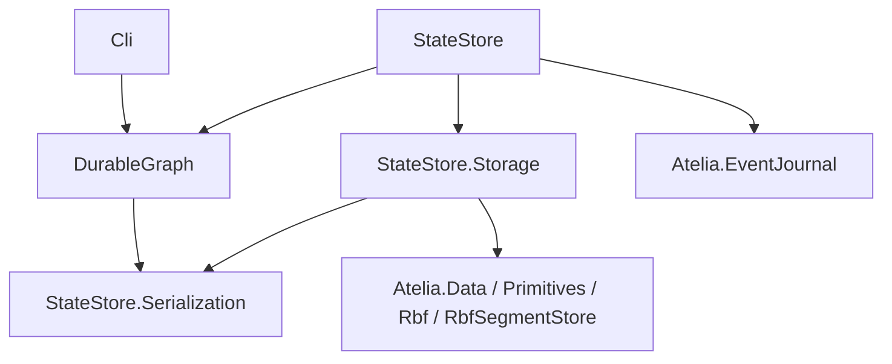

# DB-071：程序集与命名空间组织审计

> 日期：2026-09-12。源码基线：`c7ee495`。
> 状态：**Implemented / 组织迁移已实施**；实际门验收见[验收记录](0071-assembly-namespace-validation.md)。
> 采纳依据：2026-09-12，用户明确“赞同你的分析和建议”，并要求自主完成开工前方案。
> 施工约束：[实施方案](0071-assembly-namespace-implementation-work-order.md)；原启动文本：[Goal](GOAL-0071-ASSEMBLY-NAMESPACE.md)。下文保留开工前审计基线与理由，源码链接指向迁移后的对应文件。
> 问题：主要功能已贯通、兄弟项目刚开始接入时，现有程序集边界和命名空间是否仍准确表达实际职责？
> 最小验收：核对全部 `src` 项目、实际引用/生成/打包路径及真实消费者，给出有证据的保留与调整建议，区分源码兼容、二进制兼容和持久数据兼容。

## 1. 审计结论

**值得做一次有界的组织重构；优先整理命名空间和名称，保留现有主要程序集边界。**

现有代码并非无序堆积：Runtime、raw Storage 和上层持久化的依赖方向清楚，Generator/Build 也有实际加载边界。
最明显的问题是核心 Runtime 的源码与公开类型全部聚集在根命名空间，以及 `StateStore` 前缀不再准确表达几层代码的关系。
这轮没有发现必须新增程序集、改类型语义或引入通用扩展层的证据。

审计依据的强度不同；用户已采纳以下推荐方向：

1. **证据充分**：整理 Runtime 源码目录；区分领域作者入口与生成代码/高级执行契约；保留 Runtime、Storage、Serialization、Generator、Build 的现有职责边界。
2. **建议采用**：`StateStore.Serialization` 改名为 `Serialization`，`StateStore.Storage` 改名为 `Storage`；当前共同底层不应在名称上表现为上层 Store 的附属。
3. **命名选择，证据强度稍低**：上层 `StateStore` 改名为 `Persistence`。它已经包含 EventHistory、Repository、图恢复和 Schema 目录；现已选择新名，原名偏窄并不代表旧结构错误。
4. **不建议本轮做**：拆出 Schema/Abstractions、独立 EventHistory 程序集、合并全部 Runtime/Storage、迁移注册器实现、重设计公共类型或兼容转发体系。

“尚无下游投诉”限制了本轮收益的表述：不能声称它修复了现有接入故障，但源码导航、API 发现和名称准确性已有可观察的改善目标。
用户此次主动请求组织审视，已提供重新评估的时机；原型阶段避免为形式拆包的规则不是永久保留旧组织的理由。

## 2. 审计基线的项目与实际依赖

下表统计仓库物理 `.cs` 文件，排除 `bin/obj`；不把 partial 声明或生成类型当作独立文件。
七个项目共 159 个文件，另有 `src/Shared` 两个链接源码文件。
程序集名默认是项目名前加 `Atelia.`，来自 [Directory.Build.props](../../Directory.Build.props)。

| 项目 | 文件数 | 实际 namespace | 职责与判断 |
|---|---:|---|---|
| [DurableGraph](../../src/DurableGraph/DurableGraph.csproj) | 64 | `Atelia.DurableGraph` | 领域标记、Schema、绑定、Capture、容器状态操作；职责相连，根目录/namespace 过于集中 |
| [DurableGraph.StateStore](../../src/DurableGraph.Persistence/DurableGraph.Persistence.csproj) | 43 | `Atelia.DurableGraph.StateStore` | 产品持久化入口、代码目录、typed 读取、保存规划、Schema 持久化；上层整合边界成立，名称偏窄 |
| [DurableGraph.StateStore.Storage](../../src/DurableGraph.Storage/DurableGraph.Storage.csproj) | 19 | `Atelia.DurableGraph.StateStore.Storage` | raw Revision、对象版本链、map、缓存；不解释 Schema/typed body、不发布 head |
| [DurableGraph.StateStore.Serialization](../../src/DurableGraph.Serialization/DurableGraph.Serialization.csproj) | 10 | `Atelia.DurableGraph.StateStore.Serialization` | 字节读写、string codec、owned body；Runtime/Storage 的共同底层 |
| [DurableGraph.Generator](../../src/DurableGraph.Generator/DurableGraph.Generator.csproj) | 18 | `Atelia.DurableGraph.Generator` | 编译器加载的 `netstandard2.0` analyzer；另链接 Shared 两文件 |
| [DurableGraph.Build](../../src/DurableGraph.Build/DurableGraph.Build.csproj) | 4 | `Atelia.DurableGraph.Build` | `net10.0` 私有 console tool，history publish/verify；另链接 Shared 两文件 |
| [DurableGraph.Cli](../../src/DurableGraph.Cli/DurableGraph.Cli.csproj) | 1 | 顶层程序，无 namespace | 当前 `Program.cs` 仅 `return 0`；占位宿主，尚无命令功能 |

编译期普通程序集依赖如下；箭头为“依赖”，省略外部库之间的依赖：

Runtime 还具有 Generator analyzer 引用，以及不引用输出程序集的 Build 项目引用。
主包把 Generator 放到 `analyzers/dotnet/cs`，把 Build 的 DLL/deps/runtimeconfig 放到 `tools/net10.0`；
[MSBuild targets](../../src/DurableGraph/build/Atelia.DurableGraph.targets) 通过 `dotnet` 执行后者。
它们不是 Runtime 的普通运行时程序集依赖，七个项目也不等于用户必须直接引用七个包。
本轮核对的是项目与打包脚本，未重新 pack 或检查本轮生成的 nupkg。

## 3. 各边界为什么保留

### 3.1 Runtime、raw Storage 与字节底层

[ObjectVersionChain](../../src/DurableGraph.Storage/ObjectVersionChain.cs) 明确只认证记录/prior 链，
不认证 Schema、图引用或 body 语义；[StateRevisionStore](../../src/DurableGraph.Storage/StateRevisionStore.cs) 不选择和发布 head。
这是一条现有实现已经执行的语义边界，值得保留。

[IStateOps](../../src/DurableGraph/Runtime/Binding/StateValueBinding.cs) 的公开签名直接使用 `BinaryPayloadReader/Writer`、`PreparedDeltaBody`，
生成代码和 Capture 也使用 [prepared body](../../src/DurableGraph/Runtime/Capture/CapturedStatePreparation.cs)。
这些类型是 Runtime 和 Storage 的共享字节契约，把 Serialization 合并进 Runtime 会让 raw Storage 新增对整个高层 Runtime 的依赖；
反过来把 Runtime 合并进 Serialization 则消除共同底层的含义。独立的十文件项目虽小，仍有当前消费者。

Storage 故意使用底层数值 ID，不要求它为了命名整齐改用 Runtime 的 `ObjectId`；这将改变当前依赖边界，超出组织整理。

### 3.2 EventHistory 暂不独立成程序集

[EventHistoryRepository](../../src/DurableGraph.Persistence/EventHistoryRepository.cs) 直接拥有内部 `HistoryJournal`、`GraphResources`，
创建/恢复 `WorldWorkspace`，并在提交顺序中调用准备和安装操作。
[EventHistorySession](../../src/DurableGraph.Persistence/EventHistorySession.cs) 的工作区也是 internal。
它们有清晰的概念分工，但当前并没有一个已被第二种发布宿主消费的独立公共工作区合同。

现在拆 EventHistory，需要扩大 internal 的可见性、增加友元，或设计新交接 API。
这可能在另一个发布宿主出现时有价值，目前不能证明收益高于新边界的维护成本。
先用 `History/`、`Reading/`、`Saving/`、`Catalog/`、`Binding/` 目录表达职责即可。

`StateModelRegistry` 虽名为模型注册器，也不宜按名机械搬回 Runtime：
[Snapshot](../../src/DurableGraph.Persistence/StateModelRegistry.cs) 依赖同程序集的 [StateModelSnapshot](../../src/DurableGraph.Persistence/StateModelSnapshot.cs)，
后者连接实时 `SchemaStore` 权威，并承载闭合绑定缓存。
Runtime 的 `IStateModelRegistration`/`StateBindingContext` 与上层实现之间已有分工；移动实现需要另行设计。

### 3.3 Generator、Build 与 Shared

Generator 由 Roslyn 发现、运行；Build 是 MSBuild 启动的独立 .NET 10 进程。
合并它们会跨越当前目标框架和加载方式，也不能仅因都涉及 Schema history 就推导出共同运行时程序集。
[Shared](../../src/Shared) 的两个协议文件分别链接编译，避免复制维护；其类型为内部实现，暂无独立第三方消费者。
不为消除两条 `Compile Link` 再增加一个协议包。

Generator 中的 [OperationsProbeGenerator](../../src/DurableGraph.Generator/DurableGraphOperationsProbeGenerator.cs)
没有 `[Generator]` 注册，只由测试显式运行，不是产品自动图操作能力。
是否将该见证源码移到测试归属、是否显式禁止占位 CLI 打包，可作为独立小型整洁项；不是本轮拆包的依据。

## 4. 已采纳的命名空间与项目映射

保留七个项目的职责和引用边，仅对三个项目及对应程序集/包改名：

| 当前项目/程序集后缀 | 推荐后缀 | 主要收益 |
|---|---|---|
| `DurableGraph` | 保持 | 模型作者已有入口；SG 对真实标记程序集还有身份检查 |
| `DurableGraph.StateStore.Serialization` | `DurableGraph.Serialization` | 表达 Runtime/Storage 共用字节层 |
| `DurableGraph.StateStore.Storage` | `DurableGraph.Storage` | 表达独立 raw revision 存储层 |
| `DurableGraph.StateStore` | `DurableGraph.Persistence` | 覆盖 EventHistory、恢复、保存与持久目录；该名称已采纳 |
| `DurableGraph.Generator` / `.Build` / `.Cli` | 保持 | 现名与实际角色一致 |

Runtime 程序集内部可先收敛为三个 namespace，不继续按每种容器拆公开 namespace：

| namespace | 代表类型及规则 |
|---|---|
| `Atelia.DurableGraph` | 模型作者/应用注册 facade 常用的 `IDurableObject`、领域属性、`ObjectId`、`UpgradeContext`、`IStateModelRegistration`/reader/definition 登记接口；用户配置入口如 `ListDeltaAlgorithm` 也留在这里 |
| `Atelia.DurableGraph.Schema` | `DurableSchema`、`DurableFieldInfo`、`TypeExpr`、`TypeTag`、`SchemaKind`、`ObjectLayout` 及 array/List/Dictionary/Nullable layout；这是布局描述组，不新增程序集 |
| `Atelia.DurableGraph.Runtime` | binding/factory、`IStateOps`/`IValueProjection`、静态标量操作、Capture、owned 状态、容器 reader/投影等生成代码或高级手写接入所需的执行契约 |

此处维护角色与理由；完整类型分类及混合文件提取规则集中在[实施方案 §2](0071-assembly-namespace-implementation-work-order.md#2-确定的组织映射)。
同一文件混合登记接口和 binding 类时，按施工表拆源码文件，保持类型本身的成员形状/行为。
根 namespace 的登记接口可以引用 Runtime binding；namespace 不承担单向程序集依赖约束。
目录可细于 namespace，例如 Runtime 内分别使用 `Binding/`、`Capture/`、`State/` 子目录。

上层先整体采用 `Atelia.DurableGraph.Persistence`，按目录细分职责即可。
暂不再强迫普通接入同时导入 `.History`、`.Registration`、`.Policy`。
`SchemaStore` 是持久化服务，不因为名字带 Schema 就搬进描述层；`SchemaKey` 的物理归属也暂随其现有消费者。
现有 `Atelia.DurableGraph.Generated` 和 Family/DTO 命名保持：那是编译器写入各个模型程序集的生成命名空间，
已经被注册 facade、跨库导出核查和 Upgrade alias 使用，不是框架 helper 目录的另一种写法。

把高级执行契约移入 `.Runtime` 可以减轻根 namespace 的 API 发现负担，但不会使它们变成不受支持的私有实现。
生成代码在下游程序集中编译，public 可见性仍有真实用途。
现有低层 public API 也有包消费者，如 `SchemaStore`、`RevisionDecoder`、`StateRevisionStore`；不能批量改 internal。

## 5. 下游证据与兼容边界

[README](../../README.md) 的普通模型主要使用 `Atelia.DurableGraph`；完整持久化示例直接引用 Runtime 与 StateStore 两个包。
真实兄弟消费者 [FirstBoard.csproj](../../../drama-board/src/FirstBoard/FirstBoard.csproj) 也是这两个包，
[FirstBoardOccurrenceHistory](../../../drama-board/src/FirstBoard/Persistence/FirstBoardOccurrenceHistory.cs)
集中使用 Repository/Session，业务文件无需知道 raw Storage。
[Kernel 注册 facade](../../../drama-board/src/Kernel/KernelDurableModels.cs) 接受根 namespace 的 `IStateModelRegistration`，
然后调用本程序集的 `Generated.DurableDefinitions.Register`。

没有发现当前下游因 namespace 数量而受阻的证据。已有反馈主要是模型形状与 EventHistory 使用合同；
这些不能重新包装成组织缺陷。收益主要面向维护和后续 API 增长，代价则是立即发生的源码/包迁移。

| 兼容面 | 本次静态证据与后续要求 |
|---|---|
| 源码 | 修改 `using`、全限定名、PackageReference、项目路径；一般领域属性/接口和 Generated 名称按建议保留 |
| 生成代码 | 不能只批量改源码 namespace。SG 包含文本生成、metadata 查找和跨程序集 helper 合同核查，均需同步 |
| CLR 二进制 | namespace 与 assembly 名变化会改变类型身份/程序集引用。建议接受依赖闭包重编译；不默认承诺旧 DLL 能直接加载，不预建 TypeForwardedTo/旧包空壳 |
| 历史数据 | Schema/TypeExpr 的核心身份来自显式 DefinitionId、版本与类型表达；RepresentationId 等仍按现有目录协议解释。未把框架 CLR namespace 或 assembly 名写入这些核心身份，因此合理目标是数据格式不变，但旧包写入→新包冷开/续写必须实测 |

关键源码：

- [SG 核心标记常量](../../src/DurableGraph.Generator/DurableSchemaGenerator.cs) 和 [真实程序集检查](../../src/DurableGraph.Generator/DurableSchemaGenerator.CrossAssembly.cs)：后者要求属性来自 `Atelia.DurableGraph`，marker 位于同一程序集；不能为迁移方便削弱此检查。
- [生成 body](../../src/DurableGraph.Generator/DurableSchemaGenerator.GeneratedState.cs)、[生成 model](../../src/DurableGraph.Generator/DurableSchemaGenerator.StateModel.cs)、[跨库 helper 检查](../../src/DurableGraph.Generator/DurableSchemaGenerator.SchemaExportHelpers.cs)：均直接使用框架类型的全限定名，含 Serialization 类型。
- [TypeExprWireCodec](../../src/DurableGraph.Persistence/TypeExprWireCodec.cs) 写 kind/DefinitionId/实参；[Schema history writer](../../src/DurableGraph.Build/SchemaHistoryTool.cs) 写 ID/版本/字段与类型表达，而不是 CLR 程序集限定名。
- `InternalsVisibleTo`、主包 `build/` 和 `tools/` 路径、探针的包清单与脚本也有固定程序集/包名称，需要与项目移动一起核对。

审计阶段没有执行跨版本包实验，因此这里给出的是兼容目标及源码依据；后续实际证明见[验收记录 G3](0071-assembly-namespace-validation.md#g3跨-runtime-包与真实业务副本)。
用户显式 SchemaId 即便恰好长得像 CLR 全名，也不得随命名空间重排而替换。

## 6. 备选方案与实施门槛

| 方案 | 收益 | 代价 | 建议 |
|---|---|---|---|
| 只整理目录，namespace/包全保留 | 源码导航改善，metadata 不变 | 根 API 混居、名称滞后继续存在 | 最低风险备选，若暂不愿迁移消费者可采用 |
| 保留依赖图，整理 namespace 并修正三层名称 | 改善 API 发现和职责表达，仍复用现有模块分工 | 需要一次完整生成器、包和下游重编译验证 | **已采纳**，含 `Persistence` 名称 |
| 再拆 Schema/Abstractions/EventHistory 等程序集 | 可进一步施加编译边界 | 新项目/包、交接 API 或友元；暂无第二消费者证明收益 | 本轮不采用 |

实施按一个完整迁移窗口验收，避免兄弟项目反复追包。
具体顺序、包/历史/下游见证与完成边界只维护在[实施方案 G0–G4](0071-assembly-namespace-implementation-work-order.md#4-按依赖顺序实施与验收)。

以后出现第二种发布宿主、确实只需要 Schema 的独立消费者，或模块必须独立发布/替换时，再评估新增程序集。
不能以“类型越来越多”或“名字应该对应一层 DLL”单独触发拆包。

## 7. 本轮证据边界

两名 Terra 和两名 Luna 完成 Runtime、存储层、构建/包及下游的独立只读事实调查；主线程复核引用图、文件数、关键源码与下游入口并综合建议。
统计和依赖判断基于当前源码，不是完整 Roslyn 符号依赖分析，也没有假定反射得到的导出类型数量。
初次审计未运行 build/test/pack：产品代码与项目文件未变；当时四份文档的 diff/空白及 328 个本地链接/锚点检查通过。
后续方案编写同样没有实施产品迁移；施工就绪不代表兼容验收已经通过。
